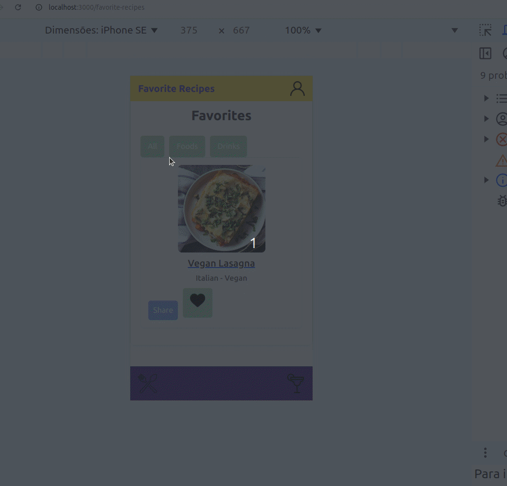

#  Project Recipes App 

## 🌐 [](https://github.com/SamuelRocha91/ProjectRecipesApp/blob/main/README.md) [](https://github.com/SamuelRocha91/ProjectRecipesApp/blob/main/README_es.md) [](https://github.com/SamuelRocha91/ProjectRecipesApp/blob/main/README_en.md) [](https://github.com/SamuelRocha91/ProjectRecipesApp/blob/main/README_ru.md) [](https://github.com/SamuelRocha91/ProjectRecipesApp/blob/main/README_ch.md) [](https://github.com/SamuelRocha91/ProjectRecipesApp/blob/main/README_ar.md)


Este projeto foi desenvolvido no módulo de Front-End do curso de Desenvolvimento Web da Trybe. Ele consiste em um aplicativo de receitas que permite aos usuários buscar, visualizar, filtrar, favoritar e acompanhar o progresso de preparação de receitas de comidas e bebidas.

O aplicativo foi desenvolvido utilizando **React** com os recursos mais modernos, como **Hooks** e **Context API**, garantindo uma gestão eficiente do estado global da aplicação. O layout do aplicativo foi otimizado para dispositivos móveis.

A aplicação foi desenvolvida com foco em dispositivos móveis, com um layout otimizado para telas de até **375px de largura**. Para garantir que a interface seja visualizada corretamente durante os testes, recomendamos utilizar as ferramentas de desenvolvimento do navegador (DevTools), simulando a aplicação em resoluções menores, como a de um smartphone. No Chrome, por exemplo, você pode ativar o **Modo de Visualização para Dispositivos Móveis** pressionando `Ctrl + Shift + M` no DevTools e ajustando a largura da tela para **375px**.

<details>
  <summary><h2>⚙️ Funcionalidades</h2></summary>
  
  - Pesquisar por receitas de comidas e bebidas;
  - Filtrar receitas por categoria;
  - Ver detalhes das receitas, incluindo ingredientes e instruções;
  - Favoritar e salvar receitas;
  - Acompanhar o progresso de preparação das receitas;
  - Ver receitas já finalizadas.

</details>



A aplicação utiliza duas APIs distintas como base de dados:

1. [TheMealDB API](https://www.themealdb.com/api.php) para receitas de comidas;
2. [TheCocktailDB API](https://www.thecocktaildb.com/api.php) para receitas de bebidas.

<details>
  <summary><h2>🛠️ Tecnologias Utilizadas</h2></summary>
  
  - **React** para criação de componentes e interface;
  - **React Router** para navegação entre as páginas;
  - **Context API** para gerenciamento global de estado;
  - **Hooks** para controle de ciclos de vida e estados locais;
  - **Bootstrap** para estilização e responsividade;
  - **Docker** para garantir portabilidade e consistência no ambiente de desenvolvimento.

</details>

<details>
  <summary><h2>🚀 Como Rodar o Projeto</h2></summary>

  ### Pré-requisitos

  - **Node.js** instalado em sua máquina (versão 14 ou superior);
  - **Docker** e **Docker Compose** instalados (caso queira rodar o projeto com Docker).

  ### Clonando o Repositório

  ```bash
  git clone https://github.com/seu-usuario/recipes-app.git
  cd recipes-app
  ```

  ### Rodando o Projeto Localmente (Sem Docker)

  1. Instale as dependências do projeto:

     ```bash
     npm install
     ```

  2. Inicie o servidor de desenvolvimento:

     ```bash
     npm start
     ```

  3. Acesse o aplicativo no navegador:

     ```
     http://localhost:3000
     ```

  ### Rodando o Projeto com Docker

  1. Construa a imagem Docker:

     ```bash
     docker build -t recipes-app .
     ```

  2. Execute o contêiner Docker:

     ```bash
     docker run -p 3000:3000 recipes-app
     ```

  3. Acesse o aplicativo no navegador:

     ```
     http://localhost:3000
     ```

  ### Estrutura do Projeto

  O projeto é organizado da seguinte forma:

  ```bash
  src/
    ├── components/          # Componentes reutilizáveis
    ├── pages/               # Páginas principais da aplicação (Login, Receitas, Favoritos, Perfil, etc.)
    ├── services/            # Lógica para requisições às APIs
    ├── context/             # Configuração de Context API
    ├── App.js               # Componente principal contendo as rotas
    └── index.js             # Ponto de entrada da aplicação
  ```

</details>

<details>
  <summary><h2>📈 Metodologias e Competências Desenvolvidas</h2></summary>

  Durante o desenvolvimento deste projeto, as seguintes competências foram trabalhadas:

  - **Metodologias Ágeis**: Trabalho em equipe utilizando **Scrum** e **Trello** para gerenciar tarefas e funcionalidades;
  - **React Routes**: Implementação de rotas dinâmicas para navegar entre as diferentes páginas da aplicação;
  - **Lógica de Programação**: Desenvolvimento de funcionalidades de busca, filtragem e manipulação de dados;
  - **Manipulação de Estado**: Gerenciamento de estado local e global com Hooks e Context API;
  - **Criação de Componentes**: Desenvolvimento de componentes reutilizáveis e responsivos para diferentes partes da aplicação.

</details>

<details>
  <summary><h2>🧪 Testes</h2></summary>

  Os testes da aplicação podem ser executados com o comando:

  ```bash
  npm test
  ```

</details>

<details>
  <summary><h2>🌟 Outros projetos</h2></summary>

  - 🐣 [Pokedex](https://github.com/SamuelRocha91/pokedex)
  - 🏪 [FrontEnd Online Store](https://github.com/SamuelRocha91/project-frontend-online-store)
  - 👛 [Expense organizer](https://github.com/SamuelRocha91/project-trybewallet)
  - 🎮 [Trivia](https://github.com/SamuelRocha91/trivia_game)

</details>
