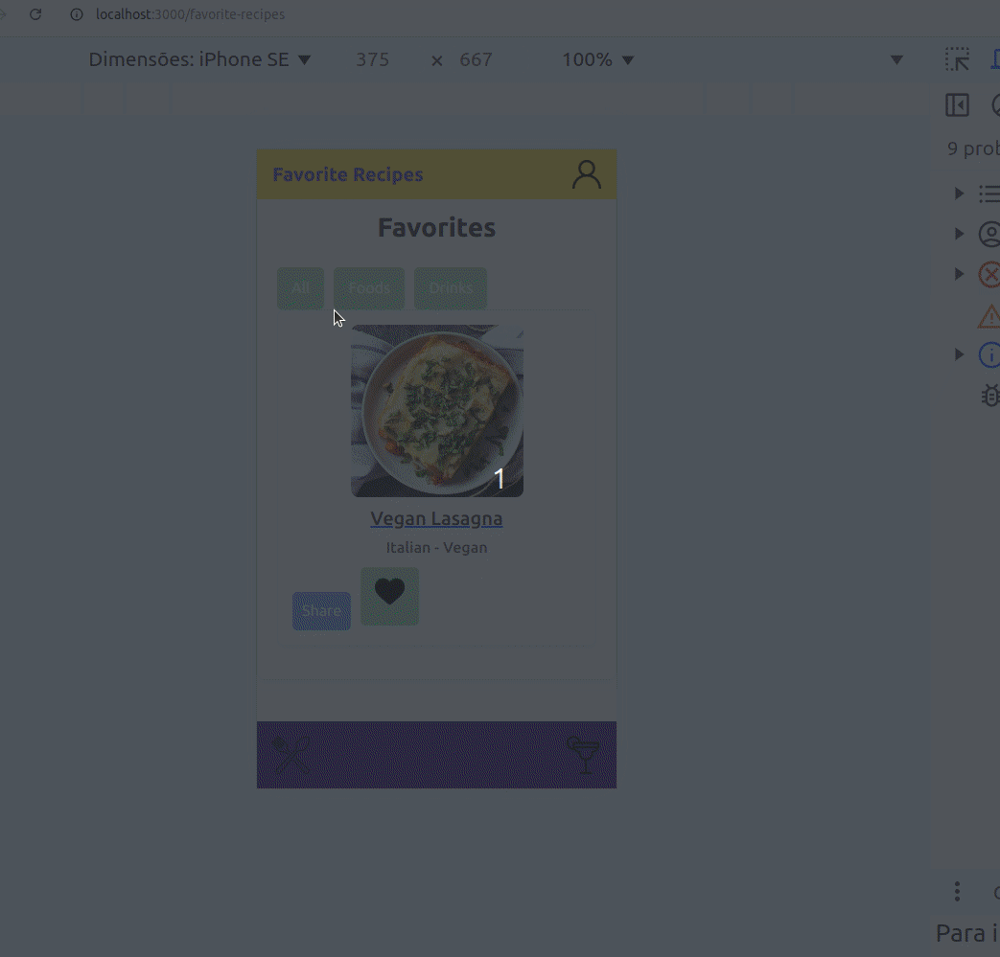

#  食谱应用程序项目 

## 🌠[](https://github.com/SamuelRocha91/ProjectRecipesApp/blob/main/README.md) [](https://github.com/SamuelRocha91/ProjectRecipesApp/blob/main/README_es.md) [](https://github.com/SamuelRocha91/ProjectRecipesApp/blob/main/README_en.md) [](https://github.com/SamuelRocha91/ProjectRecipesApp/blob/main/README_ru.md) [](https://github.com/SamuelRocha91/ProjectRecipesApp/blob/main/README_ch.md) [](https://github.com/SamuelRocha91/ProjectRecipesApp/blob/main/README_ar.md)


该项目是在Trybe的Web开发课程中开发的前端模块。它是一个食谱应用程序，允许用户搜索、查看、过滤、收藏食谱，并跟踪菜肴和饮品的制作过程。

该应用程序使用**React**开发，采用现代工具，如**Hooks**和**Context API**，以有效管理应用程序的全局状态。应用程序的设计已针对移动设备进行了优化。

应用程序专注于移动设备，设计已优化到宽度为**375像素**的屏幕。为了确保在测试时界面的正确显示，我们建议使用浏览器的开发者工具（DevTools），模拟在较小分辨率下的应用程序，例如在智能手机上。在Chrome中，您可以通过在DevTools中按 `Ctrl + Shift + M` 并将屏幕宽度设置为 **375 像素** 来启用**移动设备预览模式**。

<details>
  <summary><h2>⚙️ 功能</h2></summary>
  
  - 搜索菜肴和饮品食谱；
  - 按类别过滤食谱；
  - 查看食谱详细信息，包括成分和制作说明；
  - 收藏和保存食谱；
  - 跟踪食谱制作过程；
  - 查看已完成的食谱。

</details>



该应用程序使用两个不同的API作为数据库：

1. [TheMealDB API](https://www.themealdb.com/api.php) 用于菜肴食谱；
2. [TheCocktailDB API](https://www.thecocktaildb.com/api.php) 用于饮品食谱。

<details>
  <summary><h2>🛠️ 使用的技术</h2></summary>
  
  - **React** 用于组件和界面的创建；
  - **React Router** 用于页面之间的导航；
  - **Context API** 用于全局状态管理；
  - **Hooks** 用于管理生命周期和局部状态；
  - **Bootstrap** 用于样式和响应式设计；
  - **Docker** 用于确保开发环境中的可移植性和一致性。

</details>

<details>
  <summary><h2>🚀 如何运行项目</h2></summary>

  ### 先决条件

  - 在您的计算机上安装 **Node.js** （版本14或更高）；
  - 安装 **Docker** 和 **Docker Compose** （如果您想通过Docker运行项目）。

  ### 克隆仓库

  ```bash
  git clone https://github.com/你的用户名/recipes-app.git
  cd recipes-app
  ```

  ### 本地运行项目（无Docker）

  1. 安装项目依赖：

     ```bash
     npm install
     ```

  2. 启动开发服务器：

     ```bash
     npm start
     ```

  3. 在浏览器中打开应用程序：

     ```
     http://localhost:3000
     ```

  ### 使用Docker运行项目

  1. 构建Docker镜像：

     ```bash
     docker build -t recipes-app .
     ```

  2. 启动Docker容器：

     ```bash
     docker run -p 3000:3000 recipes-app
     ```

  3. 在浏览器中打开应用程序：

     ```
     http://localhost:3000
     ```

  ### 项目结构

  项目结构如下：

  ```bash
  src/
    ├── components/          # 可复用组件
    ├── pages/               # 应用程序的主要页面（登录、食谱、收藏、个人资料等）
    ├── services/            # API请求逻辑
    ├── context/             # Context API配置
    ├── App.js               # 主组件，包含路由
    └── index.js             # 应用程序入口点
  ```

</details>

<details>
  <summary><h2>📈 方法论与技能提升</h2></summary>

  在这个项目的开发过程中，提升了以下技能：

  - **敏捷方法论**：使用**Scrum**和**Trello**进行团队协作和任务管理；
  - **React Routes**：实现动态路由以在应用程序的不同页面之间导航；
  - **编程逻辑**：开发搜索、过滤和数据操作的功能；
  - **状态管理**：使用Hooks和Context API管理局部和全局状态；
  - **组件创建**：开发可复用和响应式的组件，以适应应用程序的不同部分。

</details>

<details>
  <summary><h2>🧪 测试</h2></summary>

  可以使用以下命令执行应用程序的测试：

  ```bash
  npm test
  ```

</details>

<details>
  <summary><h2>🌟 其他项目</h2></summary>

  - 🐣 [Pokedex](https://github.com/SamuelRocha91/pokedex/blob/main/README_ch.md)
  - 🏪 [前端在线商店](https://github.com/SamuelRocha91/project-frontend-online-store/blob/main/README_ch.md)
  - 👛 [费用管理器](https://github.com/SamuelRocha91/project-trybewallet/blob/main/README_ch.md)
  - 🎮 [Trivia](https://github.com/SamuelRocha91/trivia_game/blob/main/README_ch.md)

</details>